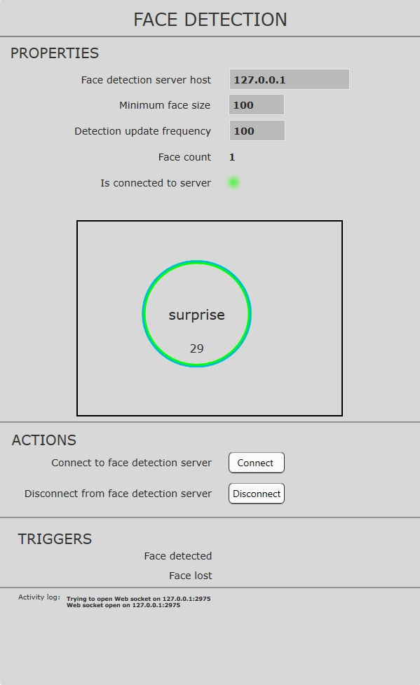

# Face Detection Interface Asset for Intuiface

Intuiface Interface Asset which uses the OpenVINO&trade; toolkit to automatically detect, log, and react to age, gender, head pose, and emotion using any camera.

It comes with a default Design Accelerator that will enable you to easily test Face Detection within Intuiface Composer.



## How to use the Face Detection Interface Asset

To add a Face Detection Interface Asset into an Intuiface experience, follow these steps:

* Close all running instances of **Intuiface Composer**.
* Download the [latest released package here](https://github.com/intuiface/FaceDetectionIA/releases).
* Extract the archive and copy the **FaceDetection** folder to the path "[Drive]:\Users\\[UserName]\Documents\Intuiface\Interface Assets".
* Launch **Intuiface Composer** and open your project.
* Open the Interface Asset panel and select the **Add an Interface Asset** option. When you enter "FaceDetection" in the search bar, you should see the **FaceDetection** Interface Asset.

## ⚙️ How to build this project

Prerequisites:

* install [Visual Studio 2015 or later](https://visualstudio.microsoft.com/fr/downloads/)
* install [CMake 3.4 or later](https://cmake.org/download/)
* install [Python 3.6.5](https://www.python.org/downloads/release/python-365/)
* install [OpenVINO](https://www.dropbox.com/s/2svslu5jkdddwj1/w_openvino_toolkit_p_2020.1.033.exe?dl=0) (version 2020.1.033)

Configure environment variables:

```bash
cd C:\\Program Files (x86)\\IntelSWTools\\openvino\\bin
setupvars.bat
```

Install OpenVINO dependencies:

```bash
cd C:\\Program Files (x86)\\IntelSWTools\\openvino\\deployment_tools\\model_optimizer\\install_prerequisites
install_prerequisites.bat
```

Install Face Detection dependencies:

* install [Boost 1.72](https://dl.bintray.com/boostorg/release/1.72.0/source/)
* create "OPEN_VINO" environment variable with value: C:\\Users\\your_username\\Documents\\Intel\\OpenVINO

## 👷 Compile and Run

Open FaceDetection.sln with Visual Studio and generate a build.
Run OpenVINOFaceDetectionServer project to launch face detection server.
Open ./dist/x64/Release/TestFaceDetection/ directory and run TestFaceDetection.exe to test Intuiface Interface Asset.

## License

Copyright © 2020 Intuiface.

Released under the MIT License.
